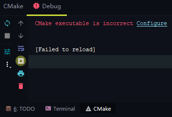
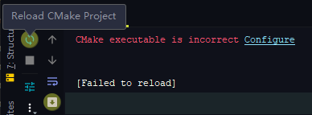
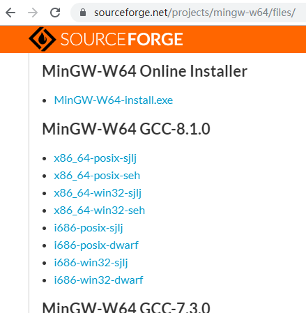

可能有人要问我了：为什么要用这个IDE？这么复杂的安装过程我为什么不用Dev-C++或者CodeBlocks？VC6.0多好用啊！

这个...我的回答是：CLion确实是一个优秀的、强大的跨平台C/C++ IDE；安装过程本身不复杂，官网提供了详尽的文档；此外，按照向导一步步做下来也是相当简单的，写这篇主要是因为...很多同学真的看到英文就害怕，对此我只能引用一下这段话：

> “英文在科学技术领域是世界语”这个事实在未来几十年都不会改变。我们在授课过程中应用的非技术词汇都很简单。因此停止抱怨，以开放的心态来迎接挑战吧。你会发现，其实挑战也并不大。

> 来源 [学堂在线](http://www.xuetangx.com/) 《电路原理》 于歆杰教授 清华大学电机系

至于它的特性和优点，你可以看[这里](https://www.jetbrains.com/clion/)。如果新手的你看不懂的话，我大概可以告诉你这几点：

- **静态代码审查** 在构建前即可知道代码中存在的问题，一般情况下一些比较傻的问题都能很快发现，可以节约大量的时间。这些提示对于提高你的代码质量也有帮助。
- **智能代码补全** 你可以利用多种技术来进行补全，包括但不限于补全关键字、变量名或者使用模板，可以大幅提高编写的速度。
- 你可以比较方便地在考试机房的电脑上安装并使用，而不需要花费很长时间，然而你可能需要等待较长时间才能把Visual Studio 2017（或者未来的更高版本）部署好。

接下来的内容我并不打算把官网上已经写得很好的安装和配置教程再重复一遍，重复造这种轮子没有意义，何况我这拙劣的技术和文笔也不见得能写出更好的教程。我只会在下面列出文档的相关地址和我被频繁地问到的问题。

此外，和[ReSharper Ultimate](https://www.jetbrains.com/resharper/)一起使用Visual Studio也是个很棒的主意。

## 申请教育版授权
学生可以获取到免费的教育版，当然，不能用于商业用途。目前，你可以在JetBrains官方网站的首页上方导航栏中的Support找到[Education](https://www.jetbrains.com/community/education/)，你会看到APPLY FOR FREE STUDENT PACK：


提供你的学生邮箱并完成申请，你将会得到1年的教育版授权。只要你持续持有学生邮箱，每年在该许可证过期前你都会收到续期提醒邮件，点击该邮件中的续期即可完成，正常情况下不需要额外操作。

> How can I renew my free educational license for another year?

> If you're still studying/teaching at a full-time educational program, you can renew your free license for another year. To do so, use the dedicated link in your JetBrains account, or use a link from the automatic email reminder we send out one week before your subscription expires.

如果你只打算使用JetBrains家的CLion，并不打算使用例如为Java等准备的IntelliJ IDEA或是为Python准备的PyCharm等工具，那么直接单独下载并安装CLion即可。

但如果你希望使用JetBrains家的多个IDE，那么我推荐你下载安装JetBrains Toolbox，然后在Toolbox中安装你需要的工具。有关Toolbox的更多信息，你可以在[这里](https://www.jetbrains.com/toolbox/app/)找到。我很推荐这么做。

## 配置Toolchain
安装完成后，第一次运行CLion的时候，会有向导指引你完成对主题、工具链（Toolchain）等的配置。我能猜到很多同学的坏习惯就是一路Next，然后进入了主界面，找到Run就想开始跑程序，然后就发现根本不能用，到处乱点半天发现解决不了于是启动了卸载程序。（摊手.jpg）IDE本身并没有集成编译器，你需要安装一个IDE支持的编译器，然后告诉IDE这个编译器的位置在哪里才能让它调用。

接下来的内容主要是针对Windows平台说明的：

### （推荐） Windows Subsystem for Linux (WSL) on Windows 10 适用于Linux的Windows子系统
目前，这是Windows 10或者Windows Server 2019上的功能。更多信息你可以在[这里](https://zh.wikipedia.org/wiki/%E9%80%82%E7%94%A8%E4%BA%8E_Linux_%E7%9A%84_Windows_%E5%AD%90%E7%B3%BB%E7%BB%9F)找到。

具体的配置方法你可以看官方的文档：[WSL - Help | CLion - JetBrains](https://www.jetbrains.com/help/clion/how-to-use-wsl-development-environment-in-clion.html)。

大致的过程就是使用`apt`安装`cmake`、`make`、`gcc`、`g++`、`gdb`用于构建和调试你的项目；还有`openssh-server`用于连接WSL，使得CLion可以调用它们。

你可以从开始菜单中进入Windows Store，搜索WSL并安装你需要的Linux发行版。目前看起来Ubuntu做得好一些。

成功打开子系统后，我建议先：（如果有必要请先更改`apt`的源，例如[阿里巴巴开源镜像站](https://opsx.alibaba.com/mirror)）

``` bash
sudo apt update
sudo apt install cmake make clang gcc g++ build-essential gdb
```

随后处理`openssh-server`：

``` bash
sudo apt remove openssh-server
sudo apt install openssh-server
```

这样之后应该就安装好了，如果有其它需求可以自行调整配置文件并重启相关服务。

这可能是当前在Windows上较好的解决方案，有相对较高的编译速度、提示速度，并且更重要的是IDE集成的控制台上输入输出都是比较正常的（如果你使用过MinGW作为工具链一段时间的话就会有这种感受）。

#### 常见问题
> 我已经在应用商店里下载了Ubuntu，但是为什么打开Ubuntu后不能用？它提示：The Windows Subsystem for Linux optional component is not enabled. Please enable it and try again.

这个...人家说得很明白了。你没有在Windows中启用WSL功能，你应该在**启用或关闭Windows功能**中打开它。如果你找不到它的话...它具体在**控制面板->程序->启用或关闭Windows功能->适用于Linux的Windows子系统**里。什么？你说你不知道Windows的控制面板在哪里？我想你应该先学会如何使用搜索引擎。

还要指出的是，这么做和直接在PowerShell中输入下面命令是等效的：

```
Enable-WindowsOptionalFeature -Online -FeatureName Microsoft-Windows-Subsystem-Linux
```

> 我已经按照上面的答案启用了WSL功能，但是再次打开Ubuntu还是没有变化？

你重启了吗？

> Ubuntu是装好了，但是我还是不能使用CLion，打开Toolchain设置后，有很多红色的错误，比如：Cannot establish connection。

事实上，这通常是因为无法通过SSH连接子系统，其实你要是去搜索SSH连接相关的问题可能更有帮助。你需要检查配置，这可能要分情况来讨论。我特意增加了这里的篇幅，一个是因为来问的同学有点多，另一个是根据分析，访问本站的用户似乎都是冲着这个问题来的...

如果是配置成功前出现的，我建议你先执行：

``` bash
ssh your_username@localhost -p22
```

这么做是因为通常IDE里连接不上通常不会给出足够的信息，不利于发现问题并修复。

别忘了改成你的用户名和端口号（默认是22，如果使用了上面文档中的脚本，可能是2222）。请注意，使用不同账户登录可能会有不同的结果（例如通常是禁止root用户使用密码登录的）！这是`/etc/ssh/sshd_config`中决定的策略，你可以随时改变它，不过记得通过

``` bash
sudo service ssh restart
```

来重启。

如果出现`Connection refused`这种信息，说明你可能根本没启动`openssh-server`或是端口等连接信息有问题。


如果你的第一次连接的时候连密钥交换都不成功的话（就是还没有问你密钥是否接受就已经失败了），通常是因为你的`openssh-server`配置不正确。这种情况高发于刚装好的子系统、从来没有执行过`sudo apt upgrade`或是没有变动过`openssh-server`的情况。这个时候你可以直接自己用`ssh-keygen`生成密钥，具体看你启动服务的时候的Warning。或是是直接这么粗暴地：

``` bash
sudo apt remove openssh-server
sudo apt install openssh-server
```

当然，直接升级应该也可以：

``` bash
sudo apt upgrade
```

好了，这么做应该重启之后是能交换密钥了，如果这么做之后出现认证失败的问题，我建议你检查一下`/etc/ssh/sshd_config`中的认证相关的策略。


如果你正在使用非root用户并且使用密码登录，你可以看看`PasswordAuthentication`后面跟的状态。如果它是`no`或是被注释状态，你可以去掉注释并“明示”它应当是`yes`。同理，你可以根据你的实际情况自行修改你的配置文件。

修改后别忘了重启。当然，在修改的时候也请注意安全，如果因为错误的配置导致不怀好意的人连接上了你的子系统，这将会是非常危险的！

差不多了，我们来看看配置成功后出现的问题，特别是重启后被问得最多的：



大概率是因为你的子系统中的`ssh-server`没有启动，你可以通过

``` bash
sudo service ssh status
```

来查看`ssh-server`的状态，


如果它没有启动，就使用

``` bash
sudo service ssh start
```

或其它等效的命令来启动它。这个时候在Settings->Toolchain中应该能看到已经能够建立连接了。

更重要的是，记得点按**Reload CMake Project**，随后你的CLion应该已经能按照预期正常工作。



补充一下，如果你的系统用户名含有非ASCII字符，例如含有中文，可能导致错误。对此的解决方案可以看官方文档，印象中下面有给出解决方案。

最后其实我想说，我实在不可能把所有可能的问题一一列举。这里应该是我看到的大部分同学会经常遇到的问题了吧。此外，我发现有同学执行了安装命令后没有注意到成功与否就继续下一步这种低级错误，这通常都是后续问题的来源。最后再废话两句，如果你的`apt`缓存过时了，请及时使用`sudo apt update`再进行操作。如果你所在的网络环境较为恶劣，那么你可能需要使用代理，并且确保你需要被代理的应用已经走了代理（这点非常重要），比如子系统是不会走在本地环回上的那种系统代理的。

在这里你可能会遇到其它问题，你可以尝试在互联网上搜索（Google is always your good friend.），或者在JetBrains IDE Support中寻求帮助。你可以把有价值的问题的详细情况在评论区中告诉我，我将在这里补充。

### Mingw-w64
如果出于某些原因你不能使用WSL，你可以尝试[Mingw-w64](https://mingw-w64.org/)（推荐）。注意，我说的并不是[MinGW](http://www.mingw.org/)，虽然它是被支持的。如果你好奇它们的区别请记得用搜索引擎找到答案。

如果使用在线安装（推荐），并且没有变更默认路径，那么你直接回到CLion的Toolchain配置页面选择MinGW应该可以直接检测到，如果不能或者你下载后自行解压到了其他位置，你只需要在配置页面中指定相应的路径即可。

#### 常见问题
不说了，麻烦看这里下载：



### Cygwin
具体的方法请看[这里](https://www.jetbrains.com/help/clion/quick-tutorial-on-configuring-clion-on-windows.html#Cygwin)。

其实就是个下载安装的过程，不过要注意的是安装过程中记得选择你需要的包，不然你就需要再装一次。

#### 常见问题
> 我已经安装好了，为什么Toolchain设置页面中还是有错误？

如果是有部分包没有检测到，你是否确认已经安装好了`make`、`gcc-core`、`gcc-g++`和`gdb`？看着Toolchain设置页面中缺啥补啥吧。
